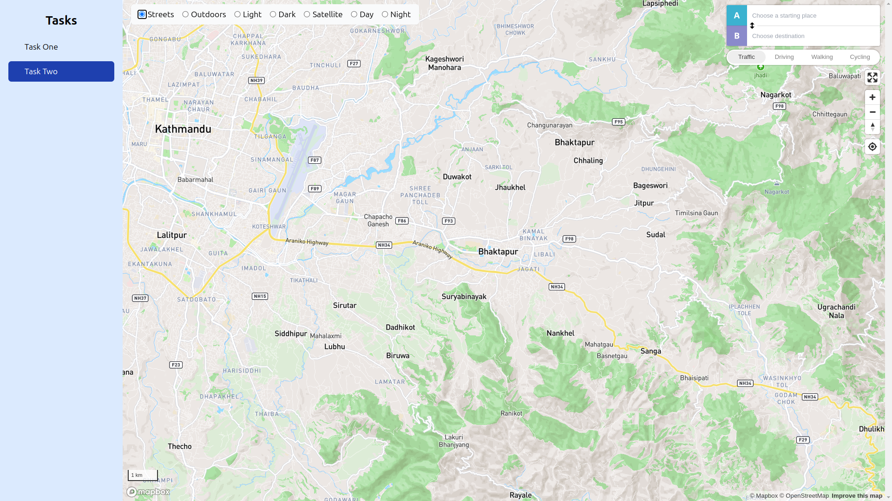

# [Charts & Map](https://github.com/rahulrajdahal/chartsandmap). Visualize your data in charts and explore the world with a Map

Visualize data in charts. Explore the world with a Map.

## Preview

[](https://github.com/rahurajdahal/chartsandmap)


## 🏗 Development Guide

### 1. clone the repository

```sh
git clone https://github.com/rahulrajdahal/chartsandmap.git
```

### 2. Install Dependencies

#### npm

```sh
cd chartsandmap && npm install
```

### 3. Update the environment variables

Create a **.env** file and add the following

// .env

```sh
VITE_MAPBOX_ACCESS_TOKEN='your mapbox access token'
```

### 4. Run development server

```sh
npm run dev
```

#### OR

### Run Production server

```sh
npm run preview
```

## 🚀 Project Structure

Inside of project [Charts & Map](https://github.com/rahulrajdahal/chartsandmap), you'll see the following folders and files:

```text
/
├── public/
│   └── favicon.svg
├── src/
|   ├── assets/
│   │   └── icon.svg
|   ├── components/
│   │   │── Component.tsx
│   │   └── index.ts
|   ├── routes/
│   │   │── __root.tsx
│   │   └── page.lazy.tsx
│   ├── main.tsx
│   ├── index.css
│── index.html
│── tailwind.config.js
│── vite.config.ts
└── package.json
```

## 🧞 Commands

All commands are run from the root of the project, from a terminal:

| Command           | Action                                        |
| :---------------- | :-------------------------------------------- |
| `npm install`     | Installs dependencies.                        |
| `npm run dev`     | Starts local dev server at `localhost:5173`.  |
| `npm run build`   | Build your production site to `./dist/`.      |
| `npm run preview` | Preview your build locally, before deploying. |
| `npm run lint`    | Check all linting errors.                     |
